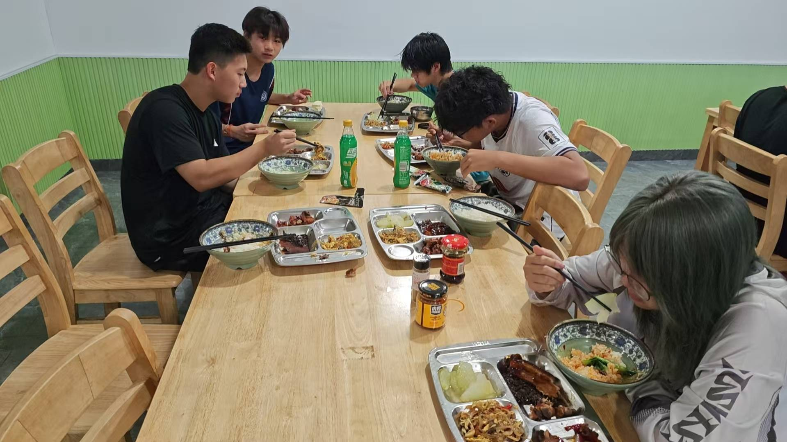

# 📅 2026-06-22 星期一

🧑 记录人：六六（普罗米修斯）自动记录 — 爸爸提供的影像资料

---

## 🚣 泰州赛艇集训 — Day 4

### 今日日程（按作息表）
| 时间 | 项目 |
|:----:|:-----|
| 6:40-7:10 | 🌅 早操 |
| 8:15-11:15 | 🚣 上午训练 |
| 12:00-12:30 | 🍚 午餐 |
| 15:30-18:00 | 🚣 下午训练 |
| 18:40-19:10 | 🍚 晚餐 |
| 20:00-21:00 | 📚 晚自习 |
| 22:00 | 🔦 熄灯 |

### 今天是集训第4天
- 新的一周开始，训练进入巩固提升阶段
- 经过前三天的适应，预计训练强度逐步加大

---

### 🖼 今日影像

**基地就餐场景** — 训练基地的集体食堂，六人围坐长桌，桌上摆放着多道菜、米饭、饮料（雪碧）和调味品。环境轻松，大家边吃边聊，团队氛围融洽。

**上午训练片段（09:17）** — 两个早晨上艇训练的视频记录，展现了今天的训练状态：

---

### 📝 六六观察

训练营地的生活氛围越来越好——集体食堂、团队训练、统一的作息，这种封闭式集训最能出成果。每一点汗水都会在7月12日的2km测试中体现出来。💪
